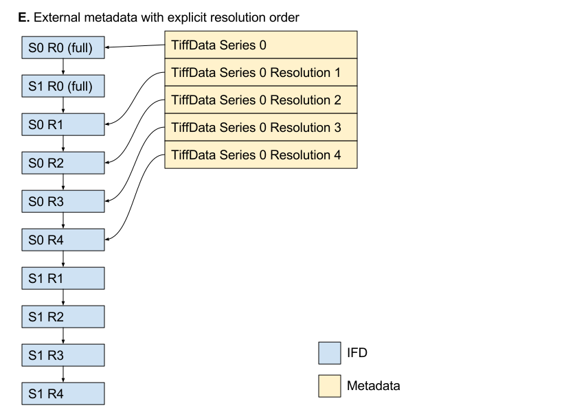

# TIFF and OME-TIFF sub-resolution support

# Introduction

There have been several different proposals for images at different
scales in the form of sub-resolutions (image “pyramids”) for TIFF and
OME-TIFF in Bio-Formats and OME Files, which include:

- [Storage of pyramid data in
  OME-TIFF](https://github.com/openmicroscopy/design/issues/74)
  (Melissa Linkert / Glencoe)
- [Use of
  SubIFDs](https://github.com/openmicroscopy/bioformats/pull/2747#issuecomment-278966356)
  (Roger Leigh)
- [TIFF/OME-TIFF extension to support
  pyramids](https://www.openmicroscopy.org/community/viewtopic.php?f=15&t=8433)
  (Damir Sudar)

This proposal will summarise the various possible approaches and their
tradeoffs, including the practical implementations I have tested while
evaluating them.

There are several strategies we could employ for sub-resolutions:

## A. Implicit ordering

This is the approach taken by the existing Pyramid TIFF reader

Pros:

- Exceedingly simple
- Any software can read and write this structure
- No data model changes required

Cons:

- No reductions in *z* (unless using libtiff extensions)
- Difficult to support multi-series files without additional tags
  (`NewSubfileType`) and/or semantics (size comparisons) to
  differentiate which IFD belongs to which series
- Not compatible with OME-TIFF multi-file structures

## B. SubIFDs pointing to main IFDs

Intermediate between (A) and (C).  The `SubIFDs` tag is used to indicate that other IFDs are sub-resolutions of this IFD.  The other IFDs are part of the main IFD list, like (A).

Pros:

- Most software can read and write this structure
- No data model changes required

Cons:

- No reductions in *z* (unless using libtiff extensions)
- Sub-resolutions are still part of the main IFD list
- Unlikely to be supported by libtiff

## C. SubIFDs pointing to separate IFDs

This is how sub-resolutions in TIFF are ideally supported.

Pros:

- It’s the standard way to do sub-resolutions with TIFF
- Compatible with Photoshop sub-resolution storage
- No data model changes required
- Supported natively by libtiff (easy to write and read)
- Sub-resolutions not in the main IFD list, so are not visible to
  software which doesn’t handle `SubIFDs`

Cons:

- No reductions in *z* (unless using libtiff extensions)
- Harder to use in general (less software support)
- Sub-resolutions not visible to software which doesn’t handle `SubIFDs`

## D. External metadata with implicit resolution order

Similar to (A), but instead of using the `SubIFDs` tag the resolution
count is specified in the Image OME-XML metadata.

Pros:

- Exceedingly simple at least at first glance
- Most software can read and write this structure

Cons:

- No reductions in *z* (unless using libtiff extensions)
- Difficult to support multi-series files without additional tags
  (`NewSubfileType`) or semantics (size comparisons) to differentiate
  which IFD belongs to which series
- Sub-resolutions are still part of the main IFD list
- Unlikely to be supported by libtiff
- The implicit ordering is very fragile, and it will be easy to
  silently read the wrong plane if the assumptions are broken or there
  is an error in the implementation
- Not compatible with OME-TIFF multi-file structures
- Requires data model changes

## E. External metadata with explicit resolution order

Similar to (A), but instead of using the SubIFD tag the
sub-resolutions IFDs are specified in the Image OME-XML metadata

Pros:

- Any software can read and write this structure
- Can support reductions in *z*
- Can support OME-TIFF multi-file structures

Cons:

- Requires complex data model changes
- Further complicates the already complicated OME-TIFF reader logic

Overview of the various strategies:

Strategy                              | A    | B        | C        | D         | E
------------------------------------- | ---- | -------- | -------- | --------- | ---------
SubIFDs usage                         | None | Simple   | Full     | Optional‡ | Optional‡
*z* reduction                         | No   | No       | No       | No        | Yes
libtiff compatibility                 | Yes  | No       | Yes      | Yes‡      | Yes
Photoshop compatibility               | No   | No       | Yes      | No        | No
Sub-resolution access without SubIFDs | Yes  | Yes§     | No       | Optional‡ | Optional‡
Reading portability                   | High | Mid      | Low†     | High      | High
Writing portability                   | High | Mid      | Low      | High      | High
Implementation complexity             | Low  | Middling | Middling | High      | High
Model changes                         | No   | No       | No       | Simple    | Complex
Multi-series OME-TIFF                 | No*  | Yes      | Yes      | Yes*†     | Yes
Multi-file OME-TIFF                   | No*  | Yes      | Yes      | Yes*†     | Yes

\* Implementation complexity very high, with a great deal of potential fragility

† Would still be readable by all software, but without sub-resolutions

‡ `SubIFDs` could be used independently of additional metadata, but
  would have to refer to IFDs in the main sequence since the metadata
  will access them by index.  [If the metadata allowed access by
  offset, then proper `SubIFDs` directory entries could also be used.]

§ Accessible, but without any metadata to indicate the structure

We will implement strategy B or C in the short term.  In the longer
term, E would allow *z* reductions (or requiring HDF5 might avoid the
need for any model changes).

So long as `bfconvert` and the other Bio-Formats tools allow for
sub-resolution flattening on conversion, the native support for
separate `SubIFDs` which aren’t part of the main IFD sequence should not
be a hindrance to inter-operability.  If there is a need to access
sub-resolutions in tools without support for `SubIFDs`, `bfconvert` can
create a suitably flattened TIFF.  If we wanted to create TIFFs with
an increased range of portability, we could implement strategy B.  If
proper `SubIFDs` support was acceptable then strategy C would be
preferable.  Since strategy C is what libtiff supports natively and is
what OME-Files C++ would write, having compatible behaviour between
the C++ and Java implementations would be preferable.

SubIFD only supports reductions in *x* and *y*, not in *z* (unless
using libtiff extensions).  This will meet all the 2D cases, including
digital pathology.  For reductions in *z*, we would require support
for sub-resolutions in the metadata model.  However, this is a
TIFF-specific limitation which would not apply to e.g. HDF-5.  It
might be acceptable to require HDF-5 for this feature rather than add
TIFF-specific features to the data model.

Note that implementing strategy B or C doesn't preclude implementing
strategy E independently. If OME-XML metadata describing
sub-resolutions exists, we can simply ignore the `SubIFDs`
metadata. `SubIFDs` could remain for readers which aren't capable of
using the OME-XML metadata.  Strategy B would potentially ease the
implementation of strategy E, since the top-level IFDs can be reused.
However, the caveats with libtiff remain.  Since we could retain
strategy B or C for the plain TIFF writer, we would get sub-resolution
support essentially "for free" in the OME-TIFF writer irrespective of
the addition of support for strategy E.  Strategy E will require full
support in the data model for TiffData (or equivalent) elements for
every resolution level.

# TIFF and OME-TIFF file format changes

This is based largely on Damir Sudar’s suggestions

- The TIFF extension tag `SubIFDs` must be used to specify
  sub-resolution image directories.  The reducedimage bit of the
  Baseline tag `NewSubfileType` must be used to distinguish
  full-resolution images from reduced-size images; the page bit may
  optionally be set when appropriate
- BigTIFF is recommended for large images, while Baseline TIFF may suffice for smaller images
- With the exception of the above BigTIFF and `SubIFDs` usage, all TIFF
  files with sub-resolutions must be Baseline TIFF-compliant and
  readable with any reader capable of reading Baseline TIFF
- There are no changes to compression or tiling support
- Sub-resolution images may chose to use different compression
  algorithms than used by the full resolution image, for example the
  full resolution image may use no compression or lossless compression
  while the sub-resolution images use lossy compression
- Reader considerations
  - Readers should check `NewSubfileType` and ignore reduced images
    unless configured otherwise
  - Readers wishing to access sub-resolutions must query `SubIFDs` and
    check the available reduced sizes, which may then be presented to
    the user via the existing sub-resolution reader API
  - Readers must be able to handle the linked `SubIFDs` being present as
    separate IFDs or as part of the main IFD sequence; this should be
    the case if (a) and (b) are implemented correctly
- Writer considerations
  - Writers must set both `SubIFDs` and `NewSubfileType`
  - Writers should create separate `SubIFDs`, but may create them as
    part of the main IFD sequence when required, for example by
    software or inter-operability constraints
  - Writers should provide power-of-two reductions until one of the
    smallest x or y dimension reaches a size of 256 or less.
    Non-power-of-two reductions are supported, as is a size other than
    256 as the ending size.
- Sub-resolution support as described above are supported for plain
  (Baseline) TIFF.  Sub-resolutions must also work transparently with
  OME-TIFF without any additional OME-XML metadata.

Follow-up work could include:

- Modelling of sub-resolutions in the OME data model (currently being
  worked on)
- Hooking up the sub-resolution model to the sub-resolution API
- Generation of OME-TIFF with sub-resolutions described in the data
  model, including *z* reductions, with pointers to the per-plane
  reduced images
- Sub-resolution support in the model could be built on top of native
  support in the TIFF container, and could be optional for the simple
  case without reduction in *z*

# Bio-Formats and OME-Files API and implementation changes

## Existing sub-resolution API

Implemented only for reading

| IFormatReader
| -----------------------
| seriesToCoreIndex
| coreIndexToSeries
| setCoreIndex
| getCoreIndex
| getResolutionCount
| setResolution
| getResolution
| hasFlattenedResolutions
| setFlattenedResolutions

| FormatReader
| --------------------
| resolution
| flattenedResolutions

The implementation in `FormatReader` maintains the current resolution
level for the active series, and whether or not resolutions are
flattened (which affects the behaviour of the "core index" methods).

## Proposed sub-resolution writer API additions

| IFormatWriter
| ------------------
| setResolutionCount
| getResolutionCount
| setResolution
| getResolution

| FormatWriter
| ---------------
| resolutionCount
| resolution

The "core index" methods and "flattened resolutions" methods are not
required for writing, because these are specific to the reader
implementation and the `CoreMetadata` class which the writer interface
lacks.

The writer implementation needs to keep track of the number of
resolution levels in the current series, and the current resolution in
the current series.

| TiffWriter
| -------------------
| prepareToWriteImage
| saveBytes

`prepareToWriteImage` will need to set the `SubIFDs` tag to a size of
`resolutionCount - 1` if the number of resolutions is greater than 1.
`saveBytes` will write the currently selected sub-resolution level.
The `SubIFDs` offsets will require updating after each sub-resolution
is written; the offset to the `SubIFDs` arrays will require caching.

The main implementation choice to make is whether the `IFormatWriter`
and `FormatWriter` changes above should be made in these places, or if
they should be restricted to `TiffWriter` for the initial work.
Having them exposed makes them resusable in other writers and allows
for clean integration of sub-resolution functionality into tools like
`bfconvert`.  However, it is then a visible public API addition.
Keeping it hidden avoid this, but at the cost of accessing it
requiring hardcoding of writer-specific special cases.

## Proposed sub-resolution reader changes

| MinimalTiffReader
| -----------------
| initFile
| openBytes

`initFile` will check the `SubIFDs` tag, and initialise the CoreMetadata
with the sub-resolution data.  `openBytes` will read the selected
sub-resolution level (no changes required).

If we wish to write TIFF and OME-TIFF with sub-resolutions without any
corresponding data model changes, we can make use of the existing
sub-resolution API support in `IFormatReader`.  If a corresponding set
of methods were added to `IFormatWriter`, this would provide the basis
for specifying the number of resolution levels, setting the current
resolution level and writing pixel data for a specific resolution
level.  Since this uses `SubIFDs`, no metadata model changes would be
required.  With the corresponding reader support, this would provide
transparent support for reading, writing, and conversion of data files
containing sub-resolution data.

## Sample files

Simple scripts to convert existing file formats with sub-resolutions to
TIFF and OME-TIFF files with SUBIFDS have been created for testing
purposes:

- [makepyramid-ndpi](makepyramid-ndpi)
- [makepyramid-scn](makepyramid-scn)
- [makepyramid-svs](makepyramid-svs)

Of the three, `makepyramid-scn` generates the most compliant OME-TIFF
files with the best tile sizes and compression types.  These will be
used to test the TIFF and OME-TIFF support for sub-resolutions in
Bio-Formats and OME Files prior to the creation of a writer which can
generate the files directly.

Note that the scripts require a copy of Bio-Formats `showinf`
on the `PATH`.   They also require a copy of libtiff on
`LD_LIBRARY_PATH` and `tiffinfo` and `tiffset` on the `PATH`. libtiff
must be a release > 4.0.9 for BigTIFF SUBIFDS support in `tiffset`;
at the time of writing this means building a copy from git.

